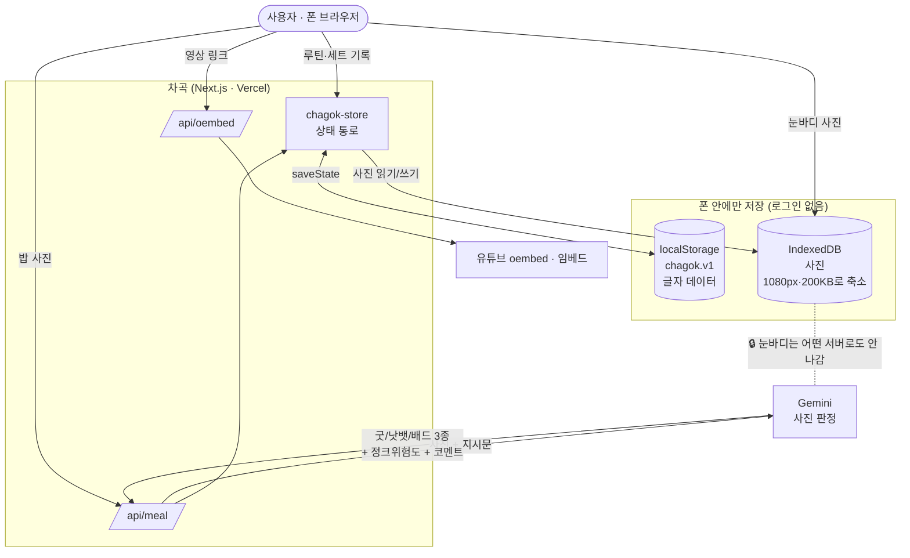

# 📑 차곡 🌰 — 프로젝트 설명서 재료 (웹 클로드 인수인계용)

> **이 파일 쓰는 법**
> 1. 이 파일을 통째로 복사해서 **웹 클로드(claude.ai)** 에 붙여넣는다
> 2. 이렇게 시킨다 → *"아래는 내가 만든 앱 자료야. 이 내용으로 **프로젝트 설명서 9개 항목**을 발표용으로 정리해줘. 없는 내용은 지어내지 말고, 비어 있는 칸은 나한테 물어봐."*
> 3. **2번(팀 빌딩)** 과 **9번(소감 PMI)** 은 우경님만 아는 내용이라 비워뒀다 → 클로드가 물어보면 그때 답하면 됨
>
> 작성일 2026-08-12 · 원본 근거: `PRD.md` · `SPEC.md` · `TASKS.md` · `🔧 운동식단가이드앱 진행상황.md`

---

## 1. 프로젝트 제목

**차곡 🌰 — 루틴을 차곡차곡 쌓는 운동·식단·눈바디 기록 웹앱**

- 이름 뜻: **차곡차곡 쌓다**. 상징은 **다람쥐 🐿️ + 도토리 🌰** (캐릭터 그림 없이 이모지만 사용)
- 핵심 규칙 한 줄: **루틴 하나 끝내면 도토리 하나 🌰**
- 한 줄 소개: Hevy(실사용 중인 운동앱)에 없는 두 가지 — ①내가 고른 **영상의 필요한 구간만** 보기 ②**사진 한 장으로 식단 신호등** — 을 채운 개인용 앱

### 💡 이름을 한 번 뒤집은 이야기 (발표에 쓰면 좋은 소재)
처음 이름은 **「삐약짐」**(병아리+gym)이었다. "운동 초보=헬린이=병아리" 논리였는데, 그 논리 자체가 함정이었다.

| | 1년 뒤에 |
|---|---|
| 삐약짐 | "나 아직도 병아리야?" → 이름이 **안 맞아짐** |
| **차곡** | "1년치가 쌓였네" → 이름이 **더 맞아짐** |

이 앱의 정체는 **쌓아서 나중에 보는 것**이라서, 다람쥐가 볼주머니에 도토리를 채우는 그림과 정확히 겹쳤다.

---

## 2. 팀 빌딩

> 🔴 **여기는 우경님이 채울 칸입니다.** (수업/캠프 팀 구성을 클로드가 알 수 없음)

**아래 표를 채우면 됩니다:**

| 이름 | 역할 | 이 프로젝트에서 한 일 |
|---|---|---|
| (우경) | 기획 · PRD 작성 · 의사결정 · 검수 | 문제 정의, 기능 결정, 실사용 테스트, 뒤집기 판단 |
| (팀원) | | |
| (팀원) | | |

**참고 — 실제 작업 구조는 이랬습니다** (혼자 했다면 이걸 그대로 쓰면 됨)
- **사람(우경)**: 문제 정의 · 무엇을 만들지 결정 · 실제로 써보고 뒤집기 · 최종 검수
- **AI(Claude Code)**: PRD·SPEC 초안 작성 · 코드 구현 · 버그 수정 · 배포
- 원칙: **"초안은 AI, 수정은 내가"** (프로젝트 기획 규칙에 명시해둔 원칙)

---

## 3. 프로젝트 기획 의도

### 한 문장 문제 정의
> 헬스장에서 운동하는 나는, **따라 하고 싶은 유튜브·릴스 루틴 영상이 있어도 그걸 기록 앱에 붙여둘 수 없어서** 매번 영상을 다시 찾아 감아야 하고, **식단과 눈바디는 아예 관리를 못 하고 있다.**

### 왜 만들었나 — 기존 앱(Hevy)이 막히는 세 군데
| # | 불편 | 내용 |
|---|---|---|
| ① | **영상 교체 불가** | 운동마다 시연 영상이 있지만 **내가 따라 하고 싶은 영상으로 못 바꾼다.** 유튜브·릴스를 따로 열어 매번 감아야 함 |
| ② | **식단 기능 없음** | 아예 없다. 그렇다고 칼로리를 세기는 귀찮다 |
| ③ | **눈바디 흩어짐** | 사진이 앨범에 섞여서, 한 달 전과 비교하려면 스크롤을 한참 올려야 함 |

### 🔍 "내 불편"이 아니라 "실제 근거"로 확인한 것 (조사 단계)
1. **Hevy 혹평 80건**을 모아 분석 → 내 불만 2가지가 실제 후기로 검증됨
   - *"짜여진 프로그램을 넣으려면 운동·세트·횟수를 전부 손으로 입력해야 한다"* (2025-11-16)
   - *"다른 앱들은 어떤 운동을 어떻게 하는지 알려줬는데 이 앱엔 그게 없다"* (2024-04-24)
2. **비슷한 앱은 있지만 방향이 반대다.** Gymdex(평가 2,274건) 같은 「링크 스크랩」 앱은 **영상 → 루틴 글자 변환** 방향이라 **영상을 글자로 바꿔 없애 버린다.**
   차곡은 **루틴 → 영상 붙이기** 방향이고 **영상을 그대로 남긴다.** 조사 범위 안에 이걸 하는 앱이 없었다 ⭐
3. **신호등 식단은 Noom이 이미 한다.** 단 **운동 기록과 한 앱에 합친 곳은 없었다** ⭐
4. ⚠️ 처음 벤치마킹 대상이던 **PeakBFF는 평가 1건짜리 신생 앱**으로 판명 → 검색 상위 비교글이 전부 자사 마케팅 블로그였다. **참고 대상에서 강등.** (조사에서 배운 것: 검색 1페이지를 믿으면 안 된다)

### 누구를 위한 것인가
- **1차: 나 자신.** "내가 4주를 못 쓰면 남도 안 쓴다"
- **2차: 링크를 받아 써볼 지인** (웹앱이라 링크만 주면 끝, 로그인 없음)
- 포지션: Hevy = 운동 잘하는 사람용 / **차곡 = 기구는 쓸 줄 알지만 좋은 루틴 영상을 저장해두고 참고하는 사람용**

### 🔴 설계 원칙 — 이 앱의 헌법
> **"복잡한 건 안 쓰게 됨."** — 이 앱이 실패하는 유일한 방법

| # | 규칙 | 구체적인 선 |
|---|---|---|
| 1 | **2번 안에 끝난다** | 앱을 열고 탭 2번 안에 기록·촬영 화면 |
| 2 | **입력창은 바로 뜬다** | 「＋」를 누르면 곧바로 입력. "무엇을 추가할까요?" 같은 중간 화면 없음 |
| 3 | **빈칸을 미리 채운다** | 세트 추가 → 직전 값이 이미 들어있음. 그대로면 ✓ 하나로 끝 |
| 4 | **설정을 묻지 않는다** | 첫 실행 설문·목표 몸무게·프로필 없음 |
| 5 | **글자 대신 그림** | 설명문을 읽어야 아는 화면은 실패 |
| 6 | **강조는 하나만** | 노란 강조는 **화면당 1개** |

### 성공 지표 (KPI)
- **주 지표: 4주 동안 주 3회 이상 루틴 완료 = 🌰 도토리 12개 이상.** 미만이면 실패로 인정하고 원인부터 찾는다
- 보조: 영상 붙인 운동 5개 이상 · 식단 판정 주 5회 · 세트 하나 기록에 **5초 이내**
- 🔴 **있으면 오히려 실패**: 칼로리 숫자 · 소셜 피드 · 로그인 강제 · 드롭다운/설문 화면

---

## 4. 전체 아키텍처

### 4-1. 메뉴 구성 (화면 깊이 지도 — 이 이상 깊어지지 않는다)

```
하단탭 4개
├── 🌰 루틴 (홈)      ─탭1→ 루틴 상세 [운동 4~5개 + 세트 기록]   ← 기록까지 2번
│      └ 맨 아래 「스트레칭」 → 썸네일 격자 보관함
│      └ 「＋ 루틴 만들기」 → 이름 입력 + 운동 담기 + 순서 끌기
├── 🍚 식단          ─탭1→ 카메라 / 앨범                        ← 촬영까지 2번
├── 📸 눈바디         ─탭1→ 앞·옆·뒤 칸 → 카메라                 ← 촬영까지 2번
└── 📅 기록          ─탭1→ 달력에서 날짜 → 그날 한 것 전부        ← 확인까지 2번
```

**실제 파일 구조**
```
app/
 ├ page.tsx              🌰 홈(루틴 목록)
 ├ routine/[id]/page.tsx    루틴 상세 (아코디언 + 세트 기록)
 ├ routine/new/page.tsx     루틴 만들기
 ├ stretch/page.tsx         스트레칭 보관함 (썸네일 격자)
 ├ meal/page.tsx         🍚 식단
 ├ body/page.tsx         📸 눈바디
 ├ log/page.tsx          📅 기록(달력)
 └ api/
    ├ meal/route.ts         식단 판정 (Gemini 호출) ← 서버에서만 실행
    └ oembed/route.ts       유튜브 제목·채널 가져오기
components/  TabBar · Stepper · ExercisePicker · VideoPicker · VideoRow · BodyCamera
lib/         chagok-store.tsx(상태 통로) · storage.ts · photos.ts · logic.ts
             video.ts(주소 해석기) · seed.ts(기본 운동 61종) · types.ts
```

### 4-2. 데이터 흐름 (dataflow)



**흐름에서 반드시 말할 3가지**
1. **글자는 localStorage(5MB 한계), 사진은 IndexedDB** — 안 나누면 금방 터진다
2. **API 키는 서버 라우트에서만** 쓴다. 화면 코드에 없다
3. 🔒 **눈바디 사진은 AI에도 서버에도 안 보낸다.** 밥 사진은 판정하려고 보내지만, 눈바디는 판정할 게 없으니 보낼 이유가 없다

### 4-3. 유저 흐름 (workflow)

```
[1] 앱 링크를 연다 (폰 브라우저 / 홈화면 아이콘)
      ↓
[2] 오늘 할 루틴을 누른다  예:「힙데이」   ← 노란 강조는 이 하나뿐
      └ 운동 4개가 한 화면에 세로로 (지금 하는 것만 펼쳐짐 = 아코디언)
      ↓
[3] 위에서 아래로 내려가며 기록   40kg × 12 → ✓
      └ 각 운동에 내가 고른 영상이 한 줄로 접혀 있음 (누르면 3:20~4:05만 재생)
      └ 「루틴 끝내기 🌰」 → 도토리 하나 쌓임
      ↓
[4] 밥 먹을 때 사진을 찍는다
      └ 탄수/단백질/지방 각각 굿·낫뱃·배드 + 정크 위험도 + 한 줄 코멘트
      └ 밤에 하루 요약: "오늘 3끼 중 2끼 괜찮았어요"
      ↓
[5] 눈바디를 앞·옆·뒤로 찍는다 (하루 1번)
      └ 지난 사진이 흐리게 겹쳐 보여서 매번 같은 자세·거리로 찍힌다
      └ 한 달 뒤 「비교」 → 첫날과 오늘이 콜라주 한 장으로
```

### 4-4. 개발 프로세스 (경량 SDD)

```
문제정의 → PRD.md(왜) → SPEC.md(무엇이 되면 완성) → TASKS.md(어떤 순서) → 구현 → 수용기준
```

| 문서 | 내용 |
|---|---|
| `PRD.md` | 육하원칙 + 1페이지 5항목. 인터뷰 4라운드로 결정 |
| `SPEC.md` | 사용자 스토리 6개(US-01~06) · **기능요구사항 FN-01~74**(MoSCoW 등급 + 수용기준) · 비기능 NFR-01~12 · 화면 11개 · **위험 9건** |
| `TASKS.md` | **T-01~T-56**을 M0~M5 단계로 분해 |

**이 문서들이 생긴 뒤 달라진 것** — AI에게 **번호로** 지시할 수 있게 됐다. *"FN-31만 고쳐줘"* / *"M1까지 만들어줘"*. 그리고 기능마다 **「이러면 완성」 기준**이 있어서 다 만든 뒤 다투지 않는다.

**진행 단계**
| 단계 | 내용 | 상태 |
|---|---|---|
| M0 | 뼈대 — Next.js·디자인토큰·저장소·기본운동 61종·탭 4개 | ✅ |
| M1 | 루틴·세트 기록·도토리·신기록 메달 | ✅ |
| M2 | 영상 붙이기·구간 자르기(주소 해석기 포함) | ✅ |
| M3 | 식단 사진 판정 (Gemini) | ✅ |
| M4 | 눈바디 + 기록 달력 | ✅ |
| **배포** | Vercel + 공개 깃허브 분리 | ✅ 2026-08-11 |
| M5 | 내보내기/가져오기 · Hevy CSV 가져오기 · 홈화면 추가(PWA) | ⬜ 남음 |

---

## 5. 사용 코딩 도구 (GenAI)

| 도구 | 어디에 썼나 |
|---|---|
| **Claude Code** (Opus 5, CLI) | **주력.** 조사·PRD/SPEC/TASKS 초안·전체 코드 구현·버그 수정·배포까지 전 과정 |
| **Claude 웹 아티팩트** | 디자인 시안(`mockup.html` 화면 7개), SPEC 읽기용 웹페이지 — **폰에서도 열려서 이동 중에 검토 가능** |
| **Gemini** (`gemini-3.5-flash-lite`) | 도구가 아니라 **앱 안에 들어간 기능** — 밥 사진 판정 |
| **Vercel** | 배포 (깃허브 연결 → 자동 배포) |

### 🔑 Claude Code에 규칙을 「박아두는」 방식을 썼다 (차별점)
매번 같은 말을 반복하지 않도록 프로젝트 폴더에 규칙 파일을 두고 AI가 자동으로 읽게 했다.

- `CLAUDE.md` — 이 앱에서만 지킬 규칙 (말투·CSS 주의사항·저장 규칙·배포 정보)
- `🔧 운동식단가이드앱 진행상황.md` — **인수인계 노트.** 새 세션을 열면 AI가 이걸 먼저 읽고 이어서 작업
- 덕분에 세션이 끊겨도 *"진행상황 노트 읽고 이어서 하자"* 한마디로 복귀됐다

### 모델 고르는 법도 규칙으로 만들었다
추측하지 말고 **① 키로 모델 목록을 조회 → ② 작은 그림 하나로 실제 시험** 후 채택.
→ `gemini-3.5-flash-lite` 사진 입력 확인 완료.

---

## 6. 사용 프롬프트 예시

> 발표 포인트: **좋은 프롬프트는 "지시"가 아니라 "판단 근거"였다.** 아래는 실제로 방향을 바꾼 프롬프트들.

### ① 흐름을 처음 정한 프롬프트
```
운동을 선택(걸맞는 가이드 영상: 본인이 원하는 영상으로 pick
영상은 틱톡 인스타 유튜브 다됨) 선택 후 운동기록 식단 사진 판정
이런 플로우인데
```
→ 여기서 기존 앱들과 **반대 방향**(영상→루틴 ❌ / 루틴→영상 ⭕)이라는 게 드러났다.

### ② 구조를 통째로 뒤집은 한 줄
```
차라리 루틴을 만드는 걸로 갈까
```
→ AI가 근거를 찾아봄: **내가 저장한 영상 5개 중 4개가 「루틴」 영상**이었다 (*"딱 5개로"* *"4가지 루틴"* *"추천 리스트"*).
→ 「운동 하나씩」에서 **「루틴 통째로」** 로 구조 변경. 헬스장에서 화면을 4번 들락날락하던 게 1번으로 줄었다.

### ③ 이름을 폐기시킨 한 줄
```
뭔가 삐약짐은 계속 쓰기 싫을거 같애 만년 초보자 같아서
```

### ④ AI가 잘못 만든 걸 잡아낸 프롬프트
```
디자인 너무 정신없어 보이는데
```
→ 원인: 카드·알약·스테퍼·썸네일·배지 **전부에** 굵은 테두리와 그림자를 줘서 뭐가 중요한지 구분이 안 됐다.
→ **「강조는 화면당 하나」** 규칙 신설.

```
자유입력창이 없어? 그럼 운동은 어떻게? 없는 운동이 있을 수 있잖아.
```
→ 「알약버튼만 쓴다」 규칙이 너무 넓게 적용돼 있었다. **「고를 때 안 쓴다는 뜻이지 아예 없다는 뜻이 아니다」** 로 규칙을 쪼갬.

### ⑤ 실제로 써보고 뒤집은 프롬프트 ⭐ (가장 중요한 사례)
에이스(버터 크래커)를 찍었더니 **「지방 낫뱃 · 정크 보통」** 이 나왔다.
```
과자 배드배드 무조건 배드!!!!
나무라
식단은 매운맛으로 가자
```
→ **원인 분석**: 지시문 맨 위의 *"나무라지 않는다"* 가 말투를 넘어 **판정 기준까지 물렁하게** 만들고 있었다.
→ **고침**: 판정 기준과 말투 규칙을 **완전히 분리.** 애매하면 나쁜 쪽으로. 과자류는 무조건 배드 3종 + 정크 많음.
→ 단, **운동 쪽은 그대로 부드럽게** 뒀다. *먹은 걸 지적하는 것과 안 온 날을 지적하는 것은 다르다.*

### ⑥ 문서 번호로 지시하기 (SPEC이 생긴 뒤)
```
FN-31만 고쳐줘
M2까지 만들어줘
```

### 💡 프롬프트에서 배운 것 3줄
1. **"안 예뻐"보다 "정신없어 보여"** 가 낫다 — 증상을 말하면 AI가 원인(강조가 너무 많음)을 찾는다
2. **실물로 시험한 결과를 그대로 던지는 게 가장 강했다** — 에이스 사진 하나가 지시문 구조를 바꿨다
3. **번호가 있으면 짧아진다** — SPEC/TASKS를 만든 뒤 프롬프트 길이가 확 줄었다

---

## 7. 기술 스택

| 구분 | 사용 기술 | 왜 이걸 골랐나 |
|---|---|---|
| **프레임워크** | **Next.js 16.3** (App Router) | 화면과 서버 라우트를 한 프로젝트에서. 앞선 날씨앱에서 해본 방식 |
| **언어** | **TypeScript 5** | |
| **UI** | **React 19.2** | |
| **스타일** | **순수 CSS** (`app/globals.css` 디자인 토큰) | UI 라이브러리 없이 — 「복잡한 건 안 쓰게 됨」 원칙대로 화면을 직접 통제 |
| **글씨체** | **주아체(Jua)** | 배달의민족 무료 배포, 둥글둥글 |
| **저장 — 글자** | **localStorage** (`chagok.v1`) | 로그인 없이 각자 폰 안에. 5MB 한계 |
| **저장 — 사진** | **IndexedDB** (자동 축소 1080px·200KB) | 사진을 localStorage에 넣으면 금방 터진다 |
| **AI 판정** | **Gemini `gemini-3.5-flash-lite`** + **responseSchema** | **정해진 칸으로 받아** 말을 뜯어읽다 틀릴 일이 없다 |
| **영상** | **유튜브 IFrame 임베드**(start/end) + **oembed API** | 구간 재생 공식 지원. **API 키 발급 불필요** |
| **카메라** | 브라우저 `getUserMedia` (눈바디 겹쳐 보기) | ⚠️ **https에서만 열린다** → 배포하고 나서야 작동 |
| **배포** | **Vercel** (`woowooff1/chagok`) | 깃허브 push → 자동 배포 |
| **버전 관리** | **Git / GitHub 공개 저장소** | `git subtree`로 이 폴더만 분리해 올림 |

### 색 팔레트
| 용도 | 색 |
|---|---|
| 강조 (**하나뿐**) | 도토리 노랑 `#FFC93C` |
| 바탕 | 크림 `#FFF8EA` |
| 글씨·진한 테두리 | 도토리 갈색 `#3D2B1C` — **검정 아님** (딱딱해 보이지 않게) |
| 연한 선 | `#EFE0C6` |
| 보조 | 연한 하늘 `#96D8EC` |
| 식단 판정 전용 | 굿 `#6BC47F` · 낫뱃 `#FFC93C` · 배드 `#FF9E7A` |

### 안 쓴 것 (의도적으로)
로그인/DB(Supabase 등) · 상태관리 라이브러리 · UI 컴포넌트 라이브러리 · 애플워치 연동 · 네이티브 앱
→ **로그인이 없으니 서버 DB도 필요 없다.** 기록은 각자 폰 안에.

---

## 8. 최종 결과물 MVP

| | |
|---|---|
| 🔗 **배포 링크 (Vercel)** | **https://chagok-woowooff1.vercel.app** |
| 💻 **깃허브 (공개)** | **https://github.com/woowooff/chagok** |
| 🎨 디자인 시안 (화면 7개) | https://claude.ai/code/artifact/c4424360-c1e7-4a22-bcd0-26d37627cabd |
| 📋 기능명세 읽기용 | https://claude.ai/code/artifact/09691515-f2e5-4757-af38-a3de032ffd91 |

> ⚠️ **주소 주의**: `chagok.vercel.app` 은 **남의 앱**(AI 용돈 계획)입니다. 우리 건 반드시 **`chagok-woowooff1`**.

### 첫 페이지(홈)에 보이는 것
```
🐿️ 오늘도 차곡차곡          도토리 12개 모았어요

┌─────────────────────────────┐
│  힙데이                       │   ← 「오늘 할 루틴」 하나만 노랑으로 크게
│  운동 4개 · 지난번 8/8 · 42분   │
└─────────────────────────────┘
   등·어깨          운동 5개 · 지난번 10/10      ← 나머지는 조용한 줄
   하체 전체        운동 4개 · 지난번 8/8
   ─────────────────────────
   🧘 스트레칭 보관함
              ＋ 루틴 만들기

  🌰 루틴   🍚 식단   📸 눈바디   📅 기록        ← 하단탭 4개
```

### 동작하는 기능 (전부 실제로 확인함)
- ✅ 루틴 만들기 / 아코디언 기록 / **직전 값 미리 채우기** / 진행 `1/3` / **신기록 메달 🏅**
- ✅ **루틴 끝내기 🌰** → 도토리 적립
- ✅ **영상 붙이기 + 구간 자르기** (유튜브·Shorts. `−1초 +1초` 미세조정)
- ✅ 틱톡·인스타는 썸네일만 + 안내 (구간 재생이 막혀 있음)
- ✅ **식단 사진 판정** (실제 배포본에서 작동 확인)
- ✅ **눈바디 앞·옆·뒤 + 지난 사진 겹쳐 보기 + 콜라주 비교**
- ✅ 기록 달력 (🟡루틴 🟢식단 🔵눈바디 점 세 색)
- ✅ 기본 운동 **61종** 내장 — 지어낸 목록이 아니라 **내 Hevy CSV에서 뽑은 실제 운동 57종** + 비어 있던 4종

### 아직 안 된 것 (M5)
내보내기/가져오기 · Hevy CSV 가져오기 · 홈화면 추가(PWA)

---

## 9. 프로젝트 소감 — PMI

> 🔴 **여기는 우경님이 직접 채울 칸입니다.** (아래는 "이런 게 있었다"는 **재료**일 뿐, 소감은 본인 말로)
> 웹 클로드에게 *"아래 재료 참고해서 질문해줘, 내가 답하면 PMI로 정리해줘"* 라고 시키면 편합니다.

### ➕ Plus — 좋았던 점 (재료)
- **문서를 먼저 만든 게 결정적이었다.** SPEC/TASKS가 생긴 뒤 *"M2까지 만들어줘"* 한마디로 지시가 끝났다
- **실제로 써보면서 고친 것**들이 앱을 살렸다 (에이스 과자 사건 → 식단 매운맛 전환)
- **하루 만에 M0~M4 + 배포**까지 갔다
- 조사 단계에서 **후기 80건**을 근거로 삼아, 내 불편이 나만의 것이 아님을 확인하고 시작했다
- 이름·구조·색을 **뒤집는 것을 두려워하지 않았다** (PRD가 하루에 8번 뒤집힘 — 그리고 그 이유를 문서에 다 남겨뒀다)

### ➖ Minus — 아쉬웠던 점 (재료)
- **컴퓨터 화면으로만 확인해서 폰 버그 3건을 놓쳤다** (흰 화면 / 영상 납작해짐 / Shorts가 아예 안 보임)
- **CSS 클래스 이름이 겹쳐서 같은 실수를 하루에 두 번** 했다 (`.rt`, `.empty`) — **빌드는 통과하고 눈으로만 잡힌다**
- **가로 영상으로만 시험**했는데 내 샘플 5개 중 3개가 Shorts였다. **세로와 가로는 다른 코드 경로를 탄다**
- AI 지시문에서 **판정 기준과 말투를 섞어 써서** 판정까지 물렁해졌다
- 배포 함정에 시간을 썼다 (`chagok.vercel.app` 선점당함 / Vercel 로그인 벽이 기본으로 걸려 폰에서 안 열림)
- 🔴 **가장 큰 아쉬움: 아직 며칠 실제로 안 써봤다.** 주 지표(도토리 12개)를 아직 재지 못했다

### 💡 Interesting — 흥미로웠던 점 (재료)
- **AI에게 "나무라지 마"라고 했더니 판정까지 물렁해졌다** — 말투 지시가 판단 기준까지 흔든다는 걸 눈으로 봤다
- **AI는 예시 문장을 그대로 베낀다** — 크래커를 "튀긴 감자"라고 불렀다. *"베끼지 말고 사진에 맞게 새로 쓰라"* 를 명시해야 했다
- **주소 해석기를 눈으로 안 보고 「자동 시험 17가지」로 확인**했다 — 재생목록 `list=` 같은 건 눈으로는 절대 못 잡는다 (안 지웠으면 끝 지점에서 안 멈추고 다음 영상으로 넘어갔을 것)
- **내 저장 영상 5개를 세어본 것**만으로 앱 구조가 통째로 바뀌었다 (4개가 루틴 영상)
- **브라우저 카메라는 https에서만 열린다** — 배포가 기능을 하나 열어줬다 (눈바디 겹쳐 보기)
- 이름을 지을 때 **"1년 뒤에도 이 이름이 맞나"** 를 물어본 게 좋은 기준이었다

---

## 📎 부록 — 웹 클로드에 붙일 원본 파일 목록

더 자세히 필요하면 아래 파일을 추가로 붙여넣으면 됩니다 (경로: `D:\CLAUDE\jeju_vibe\fitness-guide\`)

| 파일 | 무슨 내용 |
|---|---|
| `PRD.md` | 왜 만드나 — 육하원칙·설계원칙·기능 전체·KPI |
| `SPEC.md` | 기능요구사항 FN-01~74 + 수용기준 |
| `TASKS.md` | T-01~56 작업 분해 |
| `🔧 운동식단가이드앱 진행상황.md` | 날짜별 진행·삽질 기록 |
| `02_후기조사_Hevy와경쟁앱.md` | Hevy 혹평 80건 분석 (기획 근거) |
| `01_벤치마킹조사_PeakBFF.md` | 벤치마킹 + PeakBFF 강등 이유 |
